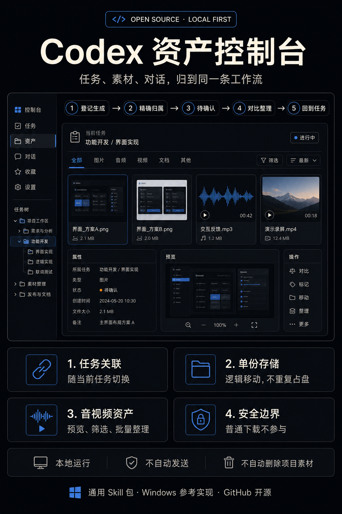

# Codex Asset Console

Windows 上的本地资产控制台参考实现。它把素材与当前 Codex 任务关联，并提供待确认、音视频浏览、受管单份存储、逻辑移动、分类和恢复能力。



## 安装

### 完整 Skill 包

1. 下载 `codex-asset-console-skill.zip`。
2. 解压到 `%USERPROFILE%\.codex\skills`；压缩包内已包含 `codex-asset-console` 目录。
3. 先预览，再安装：

```powershell
powershell -NoProfile -ExecutionPolicy Bypass -File "$env:USERPROFILE\.codex\skills\codex-asset-console\scripts\install-bundled.ps1" -WhatIf
powershell -NoProfile -ExecutionPolicy Bypass -File "$env:USERPROFILE\.codex\skills\codex-asset-console\scripts\install-bundled.ps1"
```

默认目录：

- 程序：`%LOCALAPPDATA%\Programs\Codex Asset Console`
- 状态：`%LOCALAPPDATA%\CodexAssetConsole`
- 本地服务：`%LOCALAPPDATA%\CodexAssetConsoleService`
- 快捷方式：`Codex 资产控制台`

安装器仅操作这些专属目录。更新失败会回滚程序文件；现有配置、台账和素材不会进入发布包，也不会在普通更新中被清空。

### Windows 运行时包

`codex-asset-console-windows.zip` 只包含前端运行时和安全安装/卸载脚本。需要完整本地服务时使用 Skill 包。

## 验证与卸载

```powershell
powershell -NoProfile -ExecutionPolicy Bypass -File "$env:USERPROFILE\.codex\skills\codex-asset-console\scripts\verify.ps1" -BundleOnly
powershell -NoProfile -ExecutionPolicy Bypass -File "$env:LOCALAPPDATA\Programs\Codex Asset Console\windows\uninstall.ps1"
```

## 隐私与安全

- 服务仅监听 `127.0.0.1`，API 和媒体请求使用每次安装生成的本地随机令牌。
- 发布构建会拒绝账户名、个人路径、真实 UUID、令牌、状态文件、台账和私人媒体。
- 逻辑移动只更新受管资产的组织关系，避免产生第二份受管副本；恢复操作保留可追溯记录。
- 将路径附加到任务只写入输入框，不自动发送。

## 开发

需要 Node.js 22 或更高版本：

```powershell
npm ci
npm test
powershell -NoProfile -ExecutionPolicy Bypass -File .\tools\build-release.ps1
```

## License

[MIT](LICENSE)
